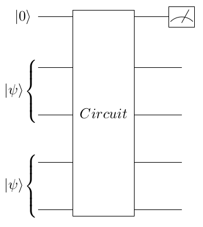

# Quantum-purity
This repository provides a quantum purity calculation problem for the genetic algorithm provided in https://github.com/vasekp/quantum-ga

The problem is described in detail in https://arxiv.org/pdf/1804.03719.pdf (section "XIV. Quantum Principal Component Analysis").

In short, with this problem the genetic algorithm tries to find a five-qubit quantum circuit that calculates the purity of a one-qubit quantum state. In the procedure, the state of interest |ψ0⟩ is first classically purified to a two-qubit pure state |ψ⟩. As input, the five-qubit circuit takes a joint state of one ancilla qubit in |0⟩ state and two copies of |ψ⟩. After the circuit, the expectation value of the ancilla qubit is measured in the Z-basis, and that expectation value is the purity of the one-qubit state that is under scrutiny. Inputs and outputs are visualized in the following figure:

